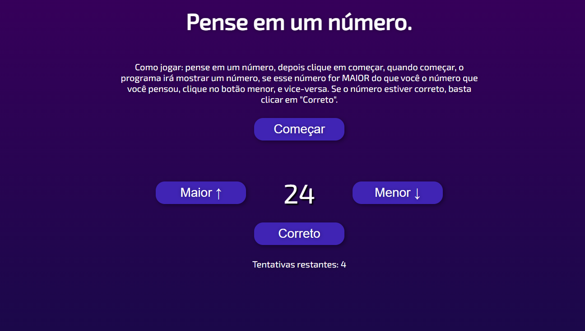

# Pense em um Número!
Algoritmo que adivinha o número em que você está pensando

Para jogar é bem simples, depois de imaginar um número, clique em começar, assim ele exibirá um número, se o numero que você pensou, for MAIOR que o número mostrado, clique no botão "Maior", e vice-versa. Se o número está correto, clique em "Correto".

O algoritmo apenas tem 6 chances.

